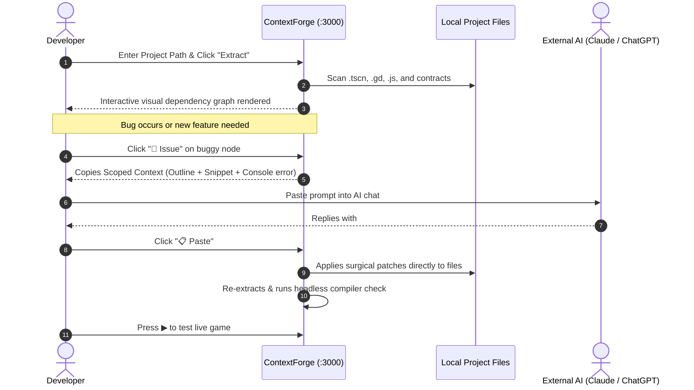

<div align="center">

# ⚡ ContextForge

**Local Architectural Workbench & Visual Dependency Graph for Godot 4.x & Web Game Engines**

[](https://nodejs.org/)
[](https://expressjs.com/)
[](https://godotengine.org/)
[](https://threejs.org/)
[](https://github.com/aymenhayderhtml-pixel/contextforge)
[](https://opensource.org/licenses/MIT)

*Bridge the gap between your game engine, local disk, and LLMs with visual topology, scope-aware context packaging, and 1-click surgical patching.*

---

</div>

## 📌 Why ContextForge?

When building games with modern LLMs (Claude, ChatGPT, Gemini, DeepSeek), developers face two painful bottlenecks:

1. **Context Window Exhaustion & Hallucination**: AI models perform best when given precise, relevant context. Dumping entire scripts and scene definitions into prompts quickly blows through token limits, degrades output quality, and causes models to hallucinate rewrites of code that was already working.
2. **Brittle Code Ingestion**: Copying code back from an AI often requires tedious manual file-by-file merges. A single missed line or indentation discrepancy can silently break GDScript compile passes or Three.js render loops.

**ContextForge fixes this.** It acts as a visual mission control on your local machine:
- It parses your project into an **interactive dependency graph** (scenes, scripts, assets, and signals).
- It extracts **targeted code snippets and lightweight API outlines** instead of full files (saving 60–80% of tokens).
- It provides a **1-click clipboard bridge (`Paste`)** that parses AI responses and applies surgical patches directly to your disk with character-level accuracy.

---

## 🚀 Key Features

### 🕸️ 1. Interactive Dependency Graph & Topology
- **Multi-Engine Extraction**: Native AST/regex-based extractors for **Godot 4.x** (`.tscn`, `.gd`, autoloads, signal wiring) and **JavaScript / TypeScript / Three.js** (ES modules, imports, canvas bindings).
- **Interactive D3 Canvas**: Force-directed layout with folder clustering (>20 nodes), 1-hop neighborhood **Focus Mode**, zero-edge orphan grouping, and zoom/pan.
- **Node Contracts & Slot Inspection**: Visualizes exported properties, signals, dependencies, and companion `.slot.json` asset contracts (GLB animations, texture dimensions).

### 🎯 2. Scope-Aware Context Packaging (`Issue`)
- **Outline Generators**: Dynamically builds lightweight signatures (classes, exported variables, public functions, signal declarations) for GDScript, JS, and HTML.
- **Target Snippet Windowing**: Given an error line or symbol name, ContextForge slices an exact window around the problem while providing surrounding files as outline contracts only.
- **Oversized File Protection**: Automatically flags monolithic files crossing safe thresholds and packages them intelligently to prevent token truncation.

### 📋 3. Surgical AI Patching Bridge (`Paste`)
- Seamlessly ingests external AI responses from your clipboard.
- **Surgical Edits (`### EDIT:`)**: Uses git-style `<<<<<<< SEARCH`, `=======`, and `>>>>>>>` blocks to make atomic changes to files on disk without risking full-file overwrites.
- **Multi-File Scaffolding (`### FILE:`)**: Automatically generates missing subdirectories and writes complete files in bulk.
- **Intelligent Filtering**: Automatically discards chat preamble, markdown tables, code explanations, and ratings from the AI response.

### 📟 4. Real-Time Console & Diagnostics Drawer
- **Godot Headless Compiler Check**: Runs rapid headless validation passes (`godot --headless --quit-after 1`) to capture GDScript parse and compile errors before opening the GUI editor.
- **Vite & Web Dev Server Integration**: Automatically manages dev server lifecycles (`npm run dev`), ports, and health checks with automatic cleanup when tabs close.
- **Filtered Diagnostic Drawer**: Color-coded log inspector with toggles for `All` vs `🔴 Red only` errors, and a dedicated `⚡ ContextForge` application console.

### 🎮 5. Engine-Native Playback & Workflows
- **Playback Trio**: Godot-styled `▶` (Play), `❚❚` (Pause / `SIGSTOP`), and `■` (Stop / `SIGTERM`) controls.
- **Web Live Preview**: Embedded collapsible iframe with auto-reload and standalone tab launch.
- **Recent Projects**: Instant project switching via the `Files ▾` menu with `localStorage` persistence.

---

## 🛠️ Architecture

```
contextforge/
├── public/                 # Vanilla JS / D3.js / CSS Frontend UI
│   ├── index.html          # Single-page dashboard, canvas & modals
│   ├── favicon.svg         # ContextForge vector brand icon
│   └── README_FOR_AI.md    # In-app AI context companion guide
├── server/                 # Express backend API & analyzers
│   ├── index.js            # HTTP server, routes, and process orchestrator
│   ├── extractors/
│   │   ├── godot-extractor.js  # Godot 4.x scene (.tscn) & script (.gd) parser
│   │   └── js-extractor.js     # JavaScript / ES module dependency extractor
│   ├── console-manager.js  # Process log buffer & headless Godot runner
│   ├── dev-server.js       # Vite / Node dev server lifecycle manager
│   ├── outline.js          # AST-free lightweight signature outline generator
│   ├── project-init.js     # New project wizard & AI clipboard block parser
│   ├── slot-contract.js    # Asset metadata & slot contract validator
│   └── schema/             # JSON Schema definitions for extraction manifests
├── test-fixtures/          # Godot & Three.js test repositories
└── docs/                   # Full architectural specifications
```

---

## 🏁 Quick Start

### Prerequisites
- **Node.js**: v18.0.0 or higher
- **npm**: v9.0.0 or higher
- *(Optional for Godot projects)*: **Godot Engine 4.x** installed and accessible in `PATH` (or `~/.local/bin/godot`).

### Installation

```bash
# 1. Clone the repository
git clone https://github.com/aymenhayderhtml-pixel/contextforge.git
cd contextforge

# 2. Install dependencies
npm install

# 3. Start the ContextForge server
npm start
```

Open your browser at:
```
http://localhost:3000
```

---

## 📖 Developer Workflow: Pairing with an AI



---

## 🤖 AI Output Formatting Guide

When instructing your AI assistant, you can click **`Files ▾` ➔ `Context for AI`** inside the app to copy the prompt guide. ContextForge expects external models to respond using one of two clean block structures:

### Surgical Edits (Preferred for existing code)

```markdown
### EDIT: scripts/Player.gd
<<<<<<< SEARCH
func take_damage(amount: int) -> void:
	health -= amount
=======
func take_damage(amount: int) -> void:
	health = max(0, health - amount)
	emit_signal("health_changed", health)
>>>>>>>
```

### Full Files (For new files or rewrites)

````markdown
### FILE: scripts/autoload/GameState.gd
```gdscript
extends Node

signal coins_changed(count: int)
var coins: int = 0

func add_coin() -> void:
	coins += 1
	coins_changed.emit(coins)
```
````

---

## 🧪 Testing

ContextForge comes with a comprehensive suite of **153 automated integration and regression tests**:

```bash
# Run the complete test suite
npm test
```

### Test Coverage Includes:
- **Schema Validation**: Validates extraction manifests against strict JSON schemas.
- **Godot Extractor**: Tests scene instancing, signal connection graphs, script exports, and autoloads.
- **JS / Three.js Extractor**: Tests ES module imports, circular dependency tolerance, and package detection.
- **Asset Graph & Slot Contracts**: Validates 3D meshes (GLB/GLTF), animations, and texture slots.
- **Scoped Context & Outlines**: Verifies line-bounded snippet windowing and signature generation.
- **Clipboard Bridge**: Validates multi-file creation and conflict-free surgical patch applications.
- **Process & Lifecycle Management**: Tests Vite dev server orchestration, signal handling (`SIGSTOP`/`SIGCONT`), and Godot headless execution.

---

## 📡 HTTP API Reference

| Endpoint | Method | Description |
| :--- | :--- | :--- |
| `/extract` | `POST` | Extracts full dependency graph manifest for a given `projectPath`. |
| `/scoped-context` | `POST` | Generates a token-optimized prompt with target snippets and dependency outlines. |
| `/add-from-clipboard` | `POST` | Parses AI clipboard content and applies `### FILE:` or `### EDIT:` changes to disk. |
| `/console-logs` | `GET` | Fetches captured runtime and compiler console logs for a project. |
| `/app-logs` | `GET` | Retrieves internal ContextForge server lifecycle logs. |
| `/game/pause` | `POST` | Toggles pause state (`SIGSTOP`/`SIGCONT`) on active Godot runtime process. |
| `/game/stop` | `POST` | Terminates active game runtime and associated dev servers. |
| `/dev-server/setup-and-start` | `POST` | Automatically runs npm setup and boots local Vite dev server. |
| `/file-tree` | `GET` | Recursively returns the directory tree of the target project. |
| `/file-content` | `GET` | Reads raw content of a specific file from disk. |

---

## 📄 License

This project is licensed under the **MIT License**. See the [LICENSE](LICENSE) file for details.
