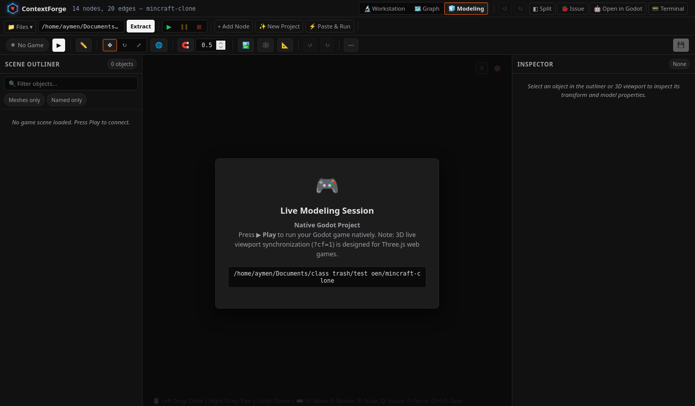
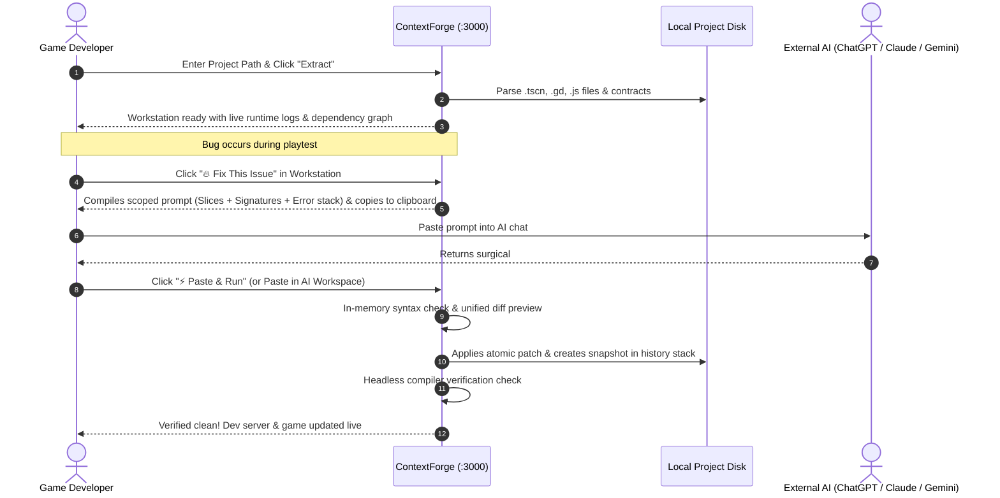

<div align="center">

# ⚡ ContextForge

**Local Architectural Workbench, 3-Pane AI Debugging Cockpit & Visual Dependency Graph for Godot 4.x & Three.js / Web Game Engines**

[](https://nodejs.org/)
[](https://expressjs.com/)
[](https://godotengine.org/)
[](https://threejs.org/)
[](https://github.com/aymenhayderhtml-pixel/contextforge)
[](https://opensource.org/licenses/MIT)

*Bridge the gap between your game engine, local disk, and external coding AIs with ground-truth topology, surgical code windowing, and safe transactional patching.*

---

[](docs/screenshot_workstation.png)
*🔬 **The 3-Pane Developer Workstation**: Problem capture, real-time error telemetry, surgical AI handoff compilation, and 1-click patch verification.*

---

</div>

## 📌 What is ContextForge?

When building games with modern LLMs (**ChatGPT, Claude, Gemini, DeepSeek**), developers encounter three recurring bottlenecks:

1. **Context Window Exhaustion & Hallucination**: Dumping full scripts, autoloads, and scene trees into prompts quickly exhausts token limits, degrades model reasoning, and causes AIs to hallucinate rewrites of functional code.
2. **Brittle AI Merging**: Pasting code back into your project requires tedious manual edits. A single missed line or indentation error can break GDScript compilation or crash Three.js game loops.
3. **Black-Box Dependencies**: Multi-session AI development obscures how scenes, signals, and scripts actually interconnect.

**ContextForge eliminates these bottlenecks.** Acting as a local developer workbench between your IDE/engine and external AI chats:
- **Never Guesses**: Extracts factual dependency graphs directly from **real source files** (Godot AST & JS module trees).
- **Saves 60–80% Tokens**: Windowed code slicing extracts only the failing function body plus public interface contracts of touching files.
- **1-Click Surgical Patching (`⚡ Paste & Run`)**: Ingests AI responses directly from your clipboard, validates syntax in memory, applies git-style surgical edits to disk, and verifies engine execution with **zero confirmation popups**.
- **Undo / Redo Safety Harness**: Every applied patch is tracked in a 20-step transactional history stack with one-click disk rollback (`Ctrl+Z`).

---

## 📸 Guided Visual Tour

### 🔬 1. The 3-Pane Developer Workstation (Default Landing View)

The workstation is designed for fast, multi-turn bug-fixing cycles with external AI models:

[](docs/screenshot_workstation.png)

- **Left Pane — Problem Definition & Runtime Diagnostics**:
  - **Issue Description**: Natural language explanation of what broke.
  - **Live Runtime Console**: Real-time project console errors with `All` and `🔴 Red only` filters, automatic stack trace parsing, and instant `🔄 Re-check`.
  - **Screenshot Evidence**: Drag-and-drop or clipboard paste for screenshots, automatically encoded into the prompt evidence bundle.
  - **Mode Selector**: Clean default mode or `⚙️ Advanced` strategy selector (`Minimal`, `Balanced`, `Deep`).
- **Center Pane — AI Workspace & Patch Studio**:
  - **State A (Handoff)**: Formats prompt tokens for Markdown, Claude, ChatGPT, Gemini, or DeepSeek with 1-click `📋 Copy Prompt` and `💾 Export .md`.
  - **State B (Patch & Verify)**: Detects applied `### EDIT:` and `### FILE:` blocks with live diff previews, in-memory GDScript/JS syntax pre-checks, and instant `↺ Undo Patch`.
  - **Session Stepper**: Visual timeline tracking iteration progress (`🐞 Problem` ➔ `📤 Handoff` ➔ `⚡ Patch` ➔ `🔬 Verify`).
- **Right Pane — ContextForge Inspector**:
  - **Ranked Context**: Automatically scores candidate project files using stack trace lines, caller/callee trees, and keyword relevance.
  - **Scoped vs Full Toggles**: Choose between targeted function slicing (token-saving) or full source inclusion.
  - **20-Step History**: Visual transaction history with timestamps and rollback buttons.
- **Split-Screen Mode (`◧ Split`)**:
  - 1-click toggle adapts the 3-pane layout into a vertical responsive column, perfect for side-by-side pairing with your browser, Godot editor, or AI chat window.

---

### 🗺️ 2. Interactive Dependency Graph View (`🗺️ Graph`)

A high-performance interactive visual map of your entire project structure:

[](docs/screenshot_graph.png)

- **Multi-Engine Extraction**:
  - **Godot 4.x**: Parses `.tscn` scenes, `.gd` scripts, `@export` parameters, custom signals, autoloads, and signal connection wiring.
  - **JavaScript / Three.js**: Parses ES modules, package dependencies, and binary 3D asset bindings.
- **Dynamic Auto-Centering & Zoom**:
  - Automatically centers and scales all nodes to fit your viewport (`fitToView`) whenever switching to graph mode.
  - D3 force simulation with smooth dragging, zooming, and panning.
- **Smart Topology & Filters**:
  - **Folder Clustering**: Automatically groups nodes by folder when project size exceeds 20 nodes to prevent visual clutter.
  - **Focus Mode (`🎯 Focus`)**: Isolates the 1-hop neighborhood of any selected node, dimming unrelated modules.
  - **Orphan Grouping**: Separates unconnected assets into a dedicated drawer.
  - **Color-Coded Legend**: Distinct visual markers for Scenes (🔴), Scripts (🟣), Modules (🔵), Assets (🟢), and Autoloads (🟡).

---

### 🧊 3. 3D Scene Modeling & Layout Studio (`🧊 Modeling`)

A dedicated 3D scene inspector and layout workspace for Three.js web games:

[](docs/screenshot_modeling.png)

- **Live Scene Outliner**: Real-time hierarchy tree of all loaded 3D meshes, groups, and lights in the game scene.
- **Transform Gizmos**: Intuitive Three.js `TransformControls` with keyboard shortcuts:
  - **W**: Translate (Position)
  - **E**: Rotate
  - **R**: Scale
  - **Q**: Toggle World / Local coordinate space
  - **F**: Focus selected object
  - **#**: Toggle ground grid
- **Inspector Form**: Live property editing for position, rotation, scale, materials, and visible flags.
- **Bi-Directional Synchronization**: Communicates over local WebSocket (`/cf`) to hot-sync layout changes directly with your running game session.

---

## ⚡ Direct 1-Click Surgical Patching (`⚡ Paste & Run`)

ContextForge features an in-memory surgical patching engine that eliminates manual copy-pasting. External AIs provide changes in standardized blocks:

### 1. Surgical Edit Block (`### EDIT:`) — Preferred for existing files
Uses git-style search/replace blocks that match disk code character-for-character:

```markdown
### EDIT: scripts/player.gd
<<<<<<< FIND
func take_damage(amount: int) -> void:
	health -= amount
=======
func take_damage(amount: int) -> void:
	health = max(0, health - amount)
	health_changed.emit(health)
>>>>>>> REPLACE
```

### 2. Full File Block (`### FILE:`) — For creating new modules
Automatically creates missing directories and writes complete files to disk:

````markdown
### FILE: scripts/save_manager.gd
```gdscript
extends Node

const SAVE_PATH = "user://savegame.json"

func save_game(data: Dictionary) -> bool:
	var file = FileAccess.open(SAVE_PATH, FileAccess.WRITE)
	if not file:
		return false
	file.store_string(JSON.stringify(data))
	return true
```
````

### 3. Safety Guarantees & Multi-Turn Protocols:
- **In-Memory Syntax Pre-Check**: Validates GDScript and JavaScript syntax before writing to disk. If an AI generates broken syntax, ContextForge blocks the write and offers "Apply Anyway" or "Reject Broken Patch".
- **Whitespace & Formatting Drift Tolerance**: Multi-pass anchor matching handles minor punctuation and indentation variations without corrupting surrounding code.
- **`CONTEXT INSUFFICIENT:` Loop Closure**: If an AI needs additional files to solve a bug, it can reply with `CONTEXT INSUFFICIENT: [path/to/file]`. ContextForge intercepts this signal, automatically attaches the requested files in full source mode, recompiles the handoff prompt, and copies it to your clipboard.

---

## 🔄 The Multi-Turn Developer Loop


```mermaid
sequenceDiagram
    autonumber
    actor Dev as Game Developer
    participant CF as ContextForge (:3000)
    participant Disk as Local Project Disk
    actor AI as External AI (ChatGPT / Claude / Gemini)

    Dev->>CF: Enter Project Path & Click "Extract"
    CF->>Disk: Parse .tscn, .gd, .js files & contracts
    CF-->>Dev: Workstation ready with live runtime logs & dependency graph
    
    Note over Dev,CF: Bug occurs during playtest
    Dev->>CF: Click "🔥 Fix This Issue" in Workstation
    CF-->>Dev: Compiles scoped prompt (Slices + Signatures + Error stack) & copies to clipboard
    
    Dev->>AI: Paste prompt into AI chat
    AI-->>Dev: Returns surgical ### EDIT: or ### FILE: blocks
    
    Dev->>CF: Click "⚡ Paste & Run" (or Paste in AI Workspace)
    CF->>CF: In-memory syntax check & unified diff preview
    CF->>Disk: Applies atomic patch & creates snapshot in history stack
    CF->>CF: Headless compiler verification check
    CF-->>Dev: Verified clean! Dev server & game updated live
```

---

## 🛠️ System Architecture

```text
contextforge/
├── public/                 # Modular Vanilla JS / CSS Client
│   ├── index.html          # Semantic HTML5 application shell
│   ├── css/                # Modular stylesheets (workstation, graph, modeling, terminal)
│   ├── js/
│   │   ├── app.js          # Client orchestration entrypoint & mode routing
│   │   ├── state.js        # Central observable state store
│   │   ├── workstation/    # 🔬 3-Pane Workstation (Problem, Workspace, Inspector, Stepper)
│   │   ├── graph/          # 🗺️ D3 Force graph simulation, clustering & zoom
│   │   ├── modeling/       # 🧊 Three.js 3D modeling viewport, outliner & gizmos
│   │   └── sidebar/        # Project disk file tree mirror
│   └── contextforge-bridge.js # Runtime browser diagnostics & error telemetry bridge
│
├── server/                 # Node.js / Express Backend Engine
│   ├── index.js            # Express server entrypoint & router mounts
│   ├── routes/             # Partitioned API routers (/extract, /context, /clipboard, etc.)
│   ├── extractors/         # AST & regex extractors (Godot 4.x & JavaScript)
│   ├── console-manager.js  # Runtime log ring buffers & headless compiler checks
│   ├── history-manager.js  # 20-step transactional disk snapshot stack
│   ├── dev-server.js       # Vite dev-server child process lifecycle manager
│   ├── outline.js          # Lightweight symbol outline generator (GDScript, JS, HTML)
│   └── project-init.js     # Surgical patch parser & engine project initializers
│
├── docs/                   # Architectural & subsystem documentation
│   ├── PROJECT_MAP.md      # Primary codebase navigation guide for developers & AIs
│   ├── ARCHITECTURE.md     # Full architectural specification & design rules
│   ├── CONTEXT_COMPILER.md # Relevance scoring & code slicing pipeline
│   ├── PATCH_ENGINE.md     # Surgical patch format, safety rules & transactions
│   └── DEBUG_SESSIONS.md   # Multi-turn sidecar session schema (.contextforge.sessions.json)
└── test-fixtures/          # Automated test sample projects (Godot & Three.js)
```

---

## 🏁 Quick Start

### Prerequisites
- **Node.js**: `v18.0.0` or higher
- **npm**: `v9.0.0` or higher
- *(Optional for Godot)*: **Godot Engine 4.x** installed and accessible in `PATH`

### 1. Installation
```bash
# Clone the repository
git clone https://github.com/aymenhayderhtml-pixel/contextforge.git
cd contextforge

# Install dependencies
npm install

# Start the application
npm start
```

### 2. Desktop Launcher (Optional)
If you prefer running ContextForge as a native desktop utility with automatic server startup:
```bash
# Linux / macOS shell launcher
./launch_contextforge.sh

# Python desktop launcher (with system tray integration)
python3 launcher.py
```

Open your browser at:
```
http://localhost:3000
```

---

## 🧪 Automated Test Suite

ContextForge is backed by **200+ automated unit, integration, and regression tests across 29 test suites**:

```bash
# Run the complete test suite
npm test
```

### Test Coverage Highlights:
- **Schema Validation**: Validates manifests against JSON schema contracts.
- **Godot AST Extractor**: Tests scene hierarchies, signal graphs, `@export` parameters, and autoload references.
- **JS / Three.js Extractor**: Tests ES module import graphs, circular references, and dynamic canvas bindings.
- **Surgical Patch Engine**: Validates multi-block surgical patching, sequential re-anchoring, and blank-line drift tolerance.
- **Context Insufficient Protocol**: Tests automated prompt re-expansion when models request missing dependencies.
- **File History & Transactions**: Verifies rollback, redo, and multi-file restoration.
- **Headless Compilers**: Tests headless Godot (`godot --headless --quit-after 1`) and Vite dev server processes.
- **Workstation UI Contracts**: Validates DOM elements, view mode switching, and layout styling.

---

## 📡 HTTP API Reference

| Method | Endpoint | Description |
| :--- | :--- | :--- |
| `POST` | `/extract` | Scans a project directory and generates the dependency graph manifest. |
| `GET` | `/manifest` | Returns the current manifest for the loaded project. |
| `POST` | `/scoped-context` | Compiles a token-optimized AI handoff prompt with target snippets and outlines. |
| `POST` | `/add-from-clipboard` | Parses AI clipboard content and applies surgical patches (`### EDIT:`) or files directly to disk. |
| `POST` | `/preview-diff` | Computes in-memory unified diffs between disk files and incoming patch without writing. |
| `POST` | `/rank-relevant-files` | Evaluates error logs and stack traces to score and rank candidate project files. |
| `GET` | `/console-logs` | Retrieves real-time engine stdout/stderr and browser console errors. |
| `POST` | `/history/undo` | Reverts the most recent file mutation or surgical patch. |
| `POST` | `/history/redo` | Re-applies the most recent undone file transaction. |
| `GET` | `/history/status` | Returns the current 20-step undo/redo transaction stack depth and descriptions. |
| `GET`, `POST` | `/debug-sessions` | Creates, lists, and appends iterations to persistent multi-turn debug sessions. |
| `POST` | `/compare-verification`| Compares error fingerprints before and after patch application to detect regressions. |
| `POST` | `/game/pause` | Sends `SIGSTOP`/`SIGCONT` to pause or resume running Godot processes. |
| `POST` | `/game/stop` | Terminates active game runtime and dev server child processes. |
| `POST` | `/dev-server/start` | Automatically starts or restarts the local Vite dev server. |
| `GET` | `/file-tree` | Recursively returns the directory tree of the loaded project. |
| `GET` | `/file-content` | Returns raw content of a specific file from disk. |

---

## 📄 License

This project is licensed under the **MIT License**. See the [LICENSE](LICENSE) file for details.
